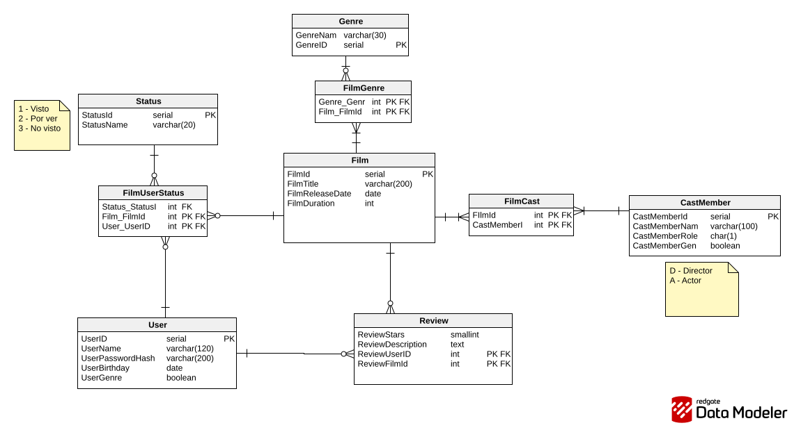

# TPGrupalWeb

TP de la cátedra Programación Web (UNICEN) — API en Go para gestionar una base de datos de películas: usuarios, films, géneros, reparto, reviews y el estado de visualización de cada usuario por película.

El objetivo del TP es preparar la capa de acceso a la base de datos y realizar testeos.

## Modelo de entidades

El diagrama completo de entidades y relaciones está en [`EntidadesPrincipales.svg`](./EntidadesPrincipales.svg):



## Estructura del repo

```
.
├── db/
│   ├── schema/       # DDL de las tablas (Postgres)
│   ├── queries/       # Queries .sql usadas por sqlc
│   └── sqlc/          # Código Go que se te va a generar
├── static/             # Archivos estáticos servidos por la API
├── CRUDSimple_test.go     # Tests de CRUD simple (Film, User, Genre, Status, CastMember)
├── CRUDCompuesto_test.go  # Tests de CRUD sobre relaciones (Review, FilmCast, FilmGenre, FilmUserStatus)
├── Dockerfile
├── docker-compose.yml
├── Makefile
├── sqlc.yaml
├── go.mod / go.sum
└── main.go
```

## Requisitos

- Go 1.25+
- Docker y Docker Compose
- sqlc

## Setup

1. Clonar el repositorio y hacer checkout sobre el branch correcto (tp2):

```bash
   git clone https://github.com/IgnacioBarboza/TPGrupalWeb/
   cd TPGrupalWeb
   git checkout tp2
```

2. Levantar todo (copy env variables + build + up + tests) con un solo comando:

```bash
   make start
```

Esto copia las variables de entorno de un env.example, limpia volúmenes viejos, genera el código de sqlc si falta, construye las imágenes, levanta los contenedores, corre los tests, y limpia todo al final. **Es el comando que se debe utilizar para probar el trabajo**

Los comandos se manejan con make:

```bash
make help
```

Los más usados:

| Comando                 | Qué hace                                                   |
| ----------------------- | ---------------------------------------------------------- |
| **make start**          | Build + up + test + limpieza, todo en un paso (quickstart) |
| **make upDocker**       | Levanta los contenedores (api + database)                  |
| **make downDocker**     | Frena los contenedores                                     |
| **make test**           | Corre los tests dentro del contenedor                      |
| **make rebuild**        | Frena y reconstruye los contenedores desde cero            |
| **make cleanVolumenes** | Frena los contenedores y borra los volúmenes de Postgres   |
| **make generatesqlc**   | Instala sqlc (si falta) y genera el código en db/sqlc/     |

## Tests

**ESTO SE ENCUENTRA INCLUIDO DENTRO DEL MAKE START, NO EJECUTAR DE MANERA AISLADA** <br>
Los tests se corren dentro del contenedor de la API, para no depender de tener Go o Postgres instalados localmente:

```bash
make test
```

Están separados en dos archivos:

- **CRUDSimple_test.go**: CRUD de entidades sin relaciones compuestas (Film, User, Genre, Status, CastMember).
- **CRUDCompuesto_test.go**: CRUD sobre las tablas de relación (Review, FilmCast, FilmGenre, FilmUserStatus), que dependen de las entidades simples para poder crearse.
